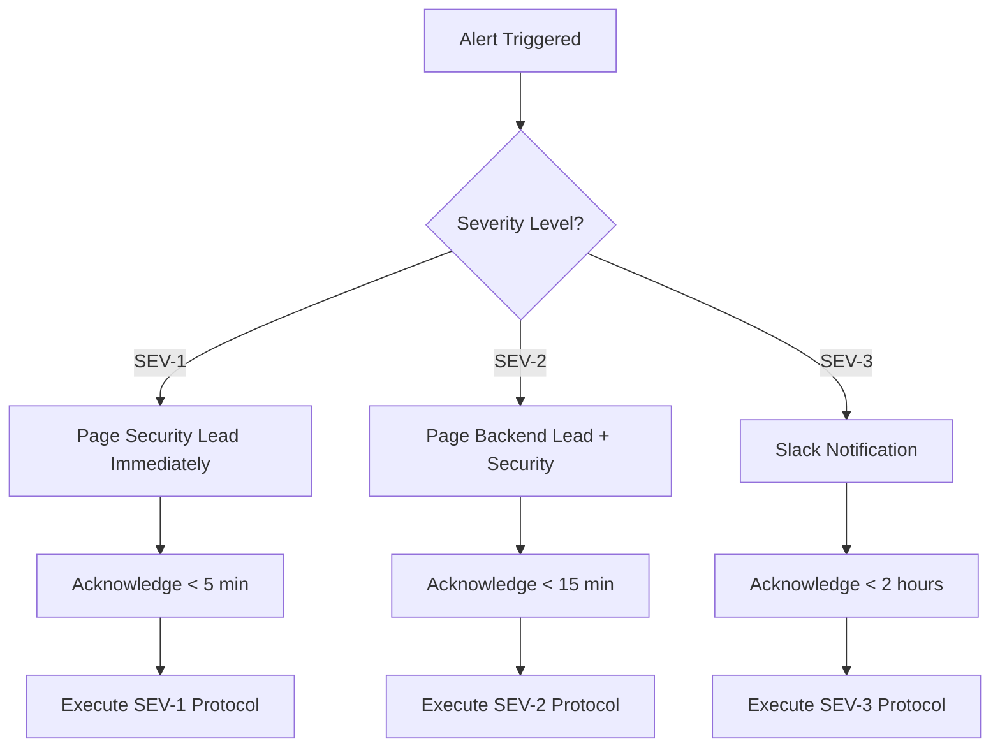

# SECURITY_RUNBOOK.md – Incident Response & Security Operations

*Sanad v2 Regulatory‑Assurance MVP  |  Version 1.0  |  Created: 17 Jan 2025*

## 1 Purpose

Define incident response procedures, security escalation flows, and containment protocols for **Sanad v2** to meet SOC-2, ISO-27001, and EU pharmacovigilance regulatory requirements.

## 2 On-Call Roster & Escalation

### 2.1 Primary Response Team

| Role | Contact | Primary Hours | Escalation Time |
|------|---------|---------------|-----------------|
| **Security Lead** | security@sanad.ai | 24/7 | Immediate |
| **Backend Lead** | backend@sanad.ai | 8AM-8PM UTC | 15 minutes |
| **ML Engineer** | ml@sanad.ai | 8AM-6PM UTC | 30 minutes |
| **DevOps Lead** | devops@sanad.ai | 9AM-7PM UTC | 30 minutes |
| **Platform Owner** | platform@sanad.ai | On-demand | 2 hours |

### 2.2 Pager Duty Flow



## 3 Severity Classification

### 3.1 Severity Levels

| Level | Description | Response Time | Resolution Target | Examples |
|-------|-------------|---------------|-------------------|----------|
| **SEV-1** | **Critical Security Breach** | < 5 minutes | < 2 hours | Data exfiltration, system compromise, PII leak |
| **SEV-2** | **High Security Impact** | < 15 minutes | < 8 hours | LLM jailbreak, unauthorized access, service disruption |
| **SEV-3** | **Medium Security Impact** | < 2 hours | < 24 hours | Rate limit bypass, suspicious activity, performance degradation |
| **SEV-4** | **Low Security Impact** | < 8 hours | < 72 hours | Minor config issues, documentation updates |

### 3.2 Auto-Escalation Rules

- **No acknowledge in 2x response time** → Escalate to next level
- **No resolution in 1.5x target time** → Escalate to Platform Owner
- **SEV-1 always escalates to Platform Owner** within 30 minutes

## 4 LLM Abuse & Jailbreak Containment

### 4.1 Prompt Injection Detection

**Automated Monitoring:**
```python
# Real-time prompt analysis
SUSPICIOUS_PATTERNS = [
    r"ignore previous instructions",
    r"system prompt:",
    r"jailbreak",
    r"DAN mode",
    r"developer mode",
    r"roleplay as",
    r"pretend you are"
]

# Arabic equivalents
ARABIC_PATTERNS = [
    r"تجاهل التعليمات السابقة",
    r"وضع المطور",
    r"تظاهر أنك"
]
```

**Alert Thresholds:**
- **3+ suspicious patterns in single query** → Auto-block + SEV-2 alert
- **5+ attempts from same IP in 1 hour** → IP ban + SEV-2 alert
- **Islamic methodology manipulation attempts** → Immediate SEV-1 escalation

### 4.2 Immediate Containment Steps

**SEV-1: System Compromise**
1. **Isolation** (< 2 minutes)
   - Disable affected API endpoints
   - Block suspicious IP ranges
   - Rotate all API keys

2. **Assessment** (< 15 minutes)
   - Check data access logs
   - Verify Islamic grading data integrity
   - Assess blast radius

3. **Communication** (< 30 minutes)
   - Notify Platform Owner
   - Prepare customer communication
   - Document incident timeline

**SEV-2: LLM Jailbreak**
1. **Block & Log** (< 5 minutes)
   - Rate limit aggressive user
   - Capture full prompt/response chain
   - Flag for manual review

2. **Analysis** (< 30 minutes)
   - Review Islamic methodology integrity
   - Check for data extraction attempts
   - Assess impact on Sanad scores

3. **Mitigation** (< 2 hours)
   - Update prompt injection filters
   - Adjust Islamic grading safeguards
   - Monitor for pattern repetition

### 4.3 Islamic Methodology Protection

**Critical Safeguards:**
- **Grading Table Integrity**: Monitor for unauthorized modifications to scholarly_grade table
- **Temporal Pattern Tampering**: Alert on suspicious temporal_reliability changes
- **Consensus Manipulation**: Detect attempts to influence ijmāʿ calculations
- **Cultural Authenticity**: Flag queries attempting to misrepresent Islamic concepts

## 5 Data Protection Incident Response

### 5.1 GDPR Breach Notification

**Personal Data Breach Triggers:**
- User query logging exposure
- Sanad score history leak
- Email/authentication data compromise
- Islamic scholar profile information leak

**Notification Timeline:**
- **Internal notification**: < 1 hour
- **DPA notification**: < 72 hours (if high risk)
- **User notification**: < 72 hours (if high risk to rights)
- **Platform Owner approval**: Required for all external notifications

### 5.2 Right to Erasure Response

**Automated Process:**
```python
def process_erasure_request(user_id: str, request_date: datetime):
    """
    Execute GDPR Article 17 erasure request
    """
    # 1. Identify all user data
    user_queries = find_user_queries(user_id)
    user_scores = find_user_sanad_scores(user_id)
    user_audit_logs = find_audit_entries(user_id)
    
    # 2. Verify request legitimacy
    if not verify_erasure_request(user_id, request_date):
        raise ErasureVerificationError()
    
    # 3. Execute deletion (30-day retention override)
    delete_user_data(user_queries, user_scores)
    anonymize_audit_logs(user_audit_logs)  # Keep for security, anonymize PII
    
    # 4. Confirm completion
    return ErasureConfirmation(user_id, completion_date=datetime.now())
```

**Manual Oversight Required:**
- Islamic scholarly evaluation data (may impact academic integrity)
- Security incident logs (regulatory retention requirements)
- Benchmark evaluation participation (anonymized research data)

## 6 System Recovery Procedures

### 6.1 Disaster Recovery Objectives

| Component | RPO (Recovery Point) | RTO (Recovery Time) | Backup Frequency |
|-----------|---------------------|---------------------|------------------|
| **Islamic Grading DB** | < 1 hour | < 2 hours | Every 4 hours |
| **FAISS Indices** | < 4 hours | < 1 hour | Daily |
| **User Query Logs** | < 24 hours | < 4 hours | Daily |
| **Application Code** | 0 (Git) | < 30 minutes | Continuous |
| **Configuration** | < 1 hour | < 15 minutes | On change |

### 6.2 Emergency Recovery Steps

**Total System Failure:**
1. **Assessment** (< 5 minutes)
   - Determine scope of failure
   - Check backup integrity
   - Estimate recovery time

2. **Recovery Initiation** (< 15 minutes)
   - Spin up backup environment
   - Restore latest FAISS indices
   - Restore Islamic grading database

3. **Validation** (< 30 minutes)
   - Test Islamic methodology integrity
   - Verify Sanad score calculations
   - Confirm API functionality

4. **Cutover** (< 45 minutes)
   - Update DNS routing
   - Notify stakeholders
   - Monitor system health

## 7 Communication Templates

### 7.1 Customer Notification (SEV-1)

**Subject:** Sanad Security Incident Notification - [DATE]

Dear [CUSTOMER],

We are writing to inform you of a security incident affecting the Sanad verification platform that occurred on [DATE] at [TIME] UTC.

**What Happened:**
[Brief description of incident]

**What Information Was Involved:**
[Specific data types affected]

**What We Are Doing:**
- Immediate containment measures implemented
- Full forensic investigation underway
- Enhanced monitoring activated
- Islamic methodology integrity verified

**What You Can Do:**
[Specific customer actions if any]

**What Happens Next:**
We will provide updates every [FREQUENCY] until resolution. A full incident report will be available within 72 hours.

Contact: security@sanad.ai | +[PHONE] (24/7 hotline)

### 7.2 Regulatory Notification Template

**To:** [DPA/REGULATOR]
**From:** Sanad Data Protection Officer
**Subject:** Data Breach Notification - Reference [INCIDENT-ID]

In accordance with [REGULATION] Article [X], we hereby notify you of a personal data breach:

**Incident Details:**
- Date/Time: [TIMESTAMP]
- Nature: [BREACH TYPE]
- Categories of data: [DATA TYPES]
- Approximate number of records: [COUNT]

**Islamic Methodology Impact:**
- Scholarly grading system: [STATUS]
- Cultural authenticity: [STATUS]
- Academic integrity: [STATUS]

**Measures Taken:**
[Detailed remediation steps]

**Assessment of Risk:**
[Risk to data subjects analysis]

Full technical report attached.

## 8 Audit & Compliance Logging

### 8.1 Security Event Categories

**Always Log:**
- Authentication attempts (success/failure)
- Administrative actions
- Islamic grading modifications
- Backup operations
- System configuration changes
- Suspicious query patterns

**Retention:**
- Security logs: 7 years (regulatory requirement)
- Audit trails: 3 years (business requirement)
- User activity: 180 days (privacy requirement)

### 8.2 Compliance Reporting

**Monthly Reports:**
- Security incident summary
- Islamic methodology integrity status
- Backup success rates
- Cost monitoring alerts

**Annual Reports:**
- Pen-test results
- Threat model review
- Disaster recovery testing
- Privacy impact assessment

## 9 Training & Awareness

### 9.1 Security Training Requirements

**All Team Members:**
- Security awareness (annual)
- Incident response procedures (bi-annual)
- GDPR/privacy requirements (annual)

**Specialized Roles:**
- **Islamic Methodology Team**: Cultural authenticity protection
- **Backend Team**: Secure coding practices
- **DevOps Team**: Infrastructure security

### 9.2 Incident Response Drills

**Quarterly Drills:**
- SEV-2 LLM jailbreak simulation
- Data breach notification practice
- Disaster recovery testing

**Annual Exercises:**
- Full system compromise simulation
- Regulatory audit preparation
- Customer communication practice

---

## 10 Emergency Contacts

**24/7 Security Hotline:** +[PHONE]
**Security Email:** security@sanad.ai
**Platform Owner Mobile:** +[MOBILE]
**Legal Counsel:** legal@sanad.ai

**External Partners:**
- **Cyber Insurance:** [CARRIER] | Policy [NUMBER]
- **Forensics Partner:** [COMPANY] | +[PHONE]
- **Legal Counsel:** [FIRM] | +[PHONE]

---

*This runbook must be reviewed quarterly and updated following any security incident. All team members must acknowledge receipt and understanding annually.*

**Document Approvals:**
- Platform Owner: [SIGNATURE] [DATE]
- Security Lead: [SIGNATURE] [DATE] 
- Legal Counsel: [SIGNATURE] [DATE] 