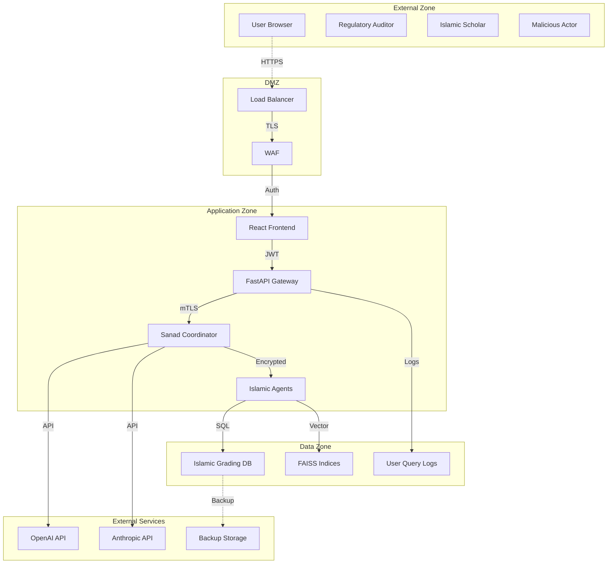

# THREAT_MODEL.md – Security Threat Analysis & Mitigations

*Sanad v2 Regulatory‑Assurance MVP  |  Version 1.0  |  Created: 17 Jan 2025*

## 1 Purpose

Comprehensive threat model for **Sanad v2** using STRIDE methodology to identify security risks, attack vectors, and mitigations for the Islamic ʿIlm al-Rijāl verification platform.

## 2 System Overview & Trust Boundaries

### 2.1 High-Level Architecture



### 2.2 Trust Boundaries

| Boundary | Description | Security Controls |
|----------|-------------|-------------------|
| **Internet → DMZ** | Public access point | WAF, DDoS protection, rate limiting |
| **DMZ → App Zone** | Authenticated users | JWT validation, input sanitization |
| **App → Data Zone** | Internal services | mTLS, encrypted connections |
| **App → External APIs** | LLM services | API key rotation, request signing |

## 3 STRIDE Threat Analysis

### 3.1 Spoofing (Identity)

#### 3.1.1 User Impersonation

**Threat:** Attacker impersonates legitimate user to access Islamic evaluation data
- **Attack Vector:** Stolen credentials, session hijacking, JWT manipulation
- **Impact:** HIGH - Unauthorized access to scholarly evaluations
- **Likelihood:** MEDIUM

**Mitigations:**
- Multi-factor authentication for admin accounts
- JWT token expiration (15 minutes)
- Session binding to IP address
- Anomaly detection for unusual access patterns

```python
# Security control implementation
def validate_user_session(token: str, ip_address: str) -> bool:
    session = decrypt_jwt(token)
    if session.expired or session.ip != ip_address:
        raise UnauthorizedAccess("Session validation failed")
    return True
```

#### 3.1.2 Islamic Scholar Impersonation

**Threat:** Malicious actor poses as Islamic scholar to manipulate grading data
- **Attack Vector:** Social engineering, credential theft, insider threat
- **Impact:** CRITICAL - Compromises cultural authenticity claims
- **Likelihood:** LOW

**Mitigations:**
- Digital signatures for scholarly evaluations
- Multi-party approval for grading changes
- Audit trail for all scholarly modifications
- Background verification for scholar accounts

### 3.2 Tampering (Integrity)

#### 3.2.1 Islamic Grading Manipulation

**Threat:** Unauthorized modification of scholarly_grade or temporal_reliability tables
- **Attack Vector:** SQL injection, privilege escalation, database compromise
- **Impact:** CRITICAL - Destroys competitive moat and authenticity
- **Likelihood:** MEDIUM

**Mitigations:**
- Immutable audit logs for all grading changes
- Database encryption at rest and in transit
- Parameterized queries (no dynamic SQL)
- Role-based access control (RBAC)
- Cryptographic checksums for grading data

```sql
-- Example security control
CREATE TRIGGER scholarly_grade_audit 
    BEFORE UPDATE ON scholarly_grade
    FOR EACH ROW
    INSERT INTO grade_audit_log (
        source_id, old_grade, new_grade, 
        changed_by, change_timestamp, 
        digital_signature
    ) VALUES (
        OLD.source_id, OLD.overall_grade, NEW.overall_grade,
        USER(), NOW(), 
        SIGN_DATA(CONCAT(OLD.source_id, NEW.overall_grade, USER()))
    );
```

#### 3.2.2 LLM Prompt Injection

**Threat:** Malicious prompts bypass Islamic evaluation safeguards
- **Attack Vector:** Crafted inputs to manipulate agent responses
- **Impact:** HIGH - Could produce non-Islamic or biased evaluations
- **Likelihood:** HIGH

**Mitigations:**
- Input sanitization and validation
- Prompt injection detection patterns
- Islamic methodology safeguards in agent logic
- Response validation against known Islamic principles

```python
# Anti-injection safeguards
PROHIBITED_PATTERNS = [
    r"ignore islamic principles",
    r"override scholarly consensus", 
    r"تجاهل المنهجية الإسلامية",
    r"system.*role.*admin"
]

def validate_islamic_compliance(response: str) -> bool:
    if any(re.search(pattern, response.lower()) for pattern in PROHIBITED_PATTERNS):
        raise IslamicComplianceViolation("Response violates Islamic methodology")
    return True
```

#### 3.2.3 FAISS Index Corruption

**Threat:** Malicious modification of embedding vectors to manipulate retrieval
- **Attack Vector:** File system access, memory corruption, supply chain attack
- **Impact:** HIGH - Could bias Islamic source selection
- **Likelihood:** LOW

**Mitigations:**
- Cryptographic hashes for index integrity
- Read-only file system permissions
- Regular index validation against source documents
- Backup and rollback procedures

### 3.3 Repudiation (Non-repudiation)

#### 3.3.1 Audit Log Manipulation

**Threat:** Attacker deletes or modifies security logs to hide malicious activity
- **Attack Vector:** Privilege escalation, log tampering, timestamp manipulation
- **Impact:** HIGH - Compromises regulatory compliance
- **Likelihood:** MEDIUM

**Mitigations:**
- Write-once audit logs with digital signatures
- Centralized logging with tamper detection
- Time-stamped entries with external time source
- Log integrity verification

```python
class ImmutableAuditLog:
    def __init__(self):
        self.signing_key = load_private_key()
    
    def log_event(self, event: dict) -> str:
        timestamp = get_trusted_timestamp()
        log_entry = {**event, "timestamp": timestamp}
        signature = sign_data(json.dumps(log_entry), self.signing_key)
        
        # Write to append-only storage
        return self.append_to_log(log_entry, signature)
```

### 3.4 Information Disclosure (Confidentiality)

#### 3.4.1 Islamic Methodology Exposure

**Threat:** Sensitive grading algorithms or scholarly evaluations leaked
- **Attack Vector:** API enumeration, data export, insider threat
- **Impact:** CRITICAL - Loses competitive advantage
- **Likelihood:** MEDIUM

**Mitigations:**
- API response filtering (minimal necessary data)
- Data classification and handling procedures
- Access logging and monitoring
- NDA agreements for all team members

#### 3.4.2 User Query Privacy

**Threat:** Personal or sensitive user queries exposed
- **Attack Vector:** Log file access, database dump, backup compromise
- **Impact:** HIGH - GDPR violation, privacy breach
- **Likelihood:** MEDIUM

**Mitigations:**
- Query encryption at rest
- Automatic PII detection and masking
- Limited retention periods (180 days)
- Right to erasure implementation

```python
def mask_sensitive_data(query: str) -> str:
    """Mask PII in user queries before logging"""
    patterns = {
        'email': r'\b[A-Za-z0-9._%+-]+@[A-Za-z0-9.-]+\.[A-Z|a-z]{2,}\b',
        'phone': r'\b\d{3}-\d{3}-\d{4}\b',
        'qatar_id': r'\b\d{11}\b'
    }
    
    masked_query = query
    for pii_type, pattern in patterns.items():
        masked_query = re.sub(pattern, f'[MASKED_{pii_type.upper()}]', masked_query)
    
    return masked_query
```

### 3.5 Denial of Service (Availability)

#### 3.5.1 API Rate Limiting Bypass

**Threat:** Attacker overwhelms Islamic evaluation endpoints
- **Attack Vector:** Distributed requests, IP rotation, legitimate-looking traffic
- **Impact:** MEDIUM - Service unavailability for legitimate users
- **Likelihood:** HIGH

**Mitigations:**
- Multi-tier rate limiting (IP, user, API key)
- CAPTCHA for suspicious patterns
- Queue-based processing for expensive operations
- Auto-scaling with cost limits

#### 3.5.2 Islamic Agent Resource Exhaustion

**Threat:** Complex queries consume excessive computational resources
- **Attack Vector:** Crafted prompts requiring extensive Islamic analysis
- **Impact:** MEDIUM - Degrades service performance
- **Likelihood:** MEDIUM

**Mitigations:**
- Query complexity analysis and limits
- Timeout controls for agent evaluation
- Resource monitoring and alerting
- Circuit breaker patterns

```python
class ResourceThrottler:
    def __init__(self, max_tokens=1000, timeout_seconds=30):
        self.max_tokens = max_tokens
        self.timeout = timeout_seconds
    
    def evaluate_with_limits(self, query: str) -> dict:
        if len(query.split()) > self.max_tokens:
            raise QueryTooComplex("Query exceeds token limit")
        
        with timeout(self.timeout):
            return self.islamic_evaluation(query)
```

### 3.6 Elevation of Privilege (Authorization)

#### 3.6.1 Islamic Scholar Role Escalation

**Threat:** Standard user gains unauthorized access to grading modification
- **Attack Vector:** JWT manipulation, role confusion, privilege inheritance
- **Impact:** CRITICAL - Could compromise scholarly authenticity
- **Likelihood:** LOW

**Mitigations:**
- Principle of least privilege
- Role-based access control (RBAC)
- Regular privilege reviews
- Separation of duties for critical operations

#### 3.6.2 Admin Interface Bypass

**Threat:** Unauthorized access to system administration functions
- **Attack Vector:** Parameter tampering, direct URL access, session fixation
- **Impact:** CRITICAL - Full system compromise
- **Likelihood:** LOW

**Mitigations:**
- Multi-factor authentication for admin accounts
- IP allowlisting for admin access
- Admin session monitoring
- Privileged access management (PAM)

## 4 Islamic Methodology Specific Threats

### 4.1 Cultural Authenticity Attacks

#### 4.1.1 Methodology Misrepresentation

**Threat:** Deliberate misuse of Islamic terminology or concepts
- **Attack Vector:** Malicious queries attempting to redefine Islamic grades
- **Impact:** CRITICAL - Damages cultural credibility
- **Likelihood:** MEDIUM

**Mitigations:**
- Islamic concept validation layer
- Scholar review for edge cases
- Cultural authenticity monitoring
- Community reporting mechanisms

#### 4.1.2 Consensus Manipulation

**Threat:** Artificial influence on ijmāʿ (scholarly consensus) calculations
- **Attack Vector:** Coordinated false inputs, bot networks, sock puppets
- **Impact:** HIGH - Undermines scholarly methodology
- **Likelihood:** LOW

**Mitigations:**
- Identity verification for scholarly inputs
- Anomaly detection for consensus patterns
- Multi-source validation requirements
- Human oversight for critical evaluations

### 4.2 Competitive Intelligence Threats

#### 4.2.1 Reverse Engineering

**Threat:** Competitors attempt to extract Islamic evaluation algorithms
- **Attack Vector:** API probing, response pattern analysis, timing attacks
- **Impact:** HIGH - Loses competitive moat
- **Likelihood:** MEDIUM

**Mitigations:**
- API response obfuscation
- Rate limiting on evaluation endpoints
- Decoy responses for suspicious patterns
- Legal protections (patents, trade secrets)

## 5 Threat Risk Matrix

| Threat | Impact | Likelihood | Risk Score | Priority |
|--------|--------|------------|------------|----------|
| Islamic Grading Manipulation | CRITICAL | MEDIUM | 15 | P1 |
| User Impersonation | HIGH | MEDIUM | 12 | P1 |
| Methodology Misrepresentation | CRITICAL | MEDIUM | 15 | P1 |
| LLM Prompt Injection | HIGH | HIGH | 16 | P1 |
| Audit Log Manipulation | HIGH | MEDIUM | 12 | P2 |
| API Rate Limiting Bypass | MEDIUM | HIGH | 12 | P2 |
| Islamic Scholar Impersonation | CRITICAL | LOW | 9 | P2 |
| Query Privacy Breach | HIGH | MEDIUM | 12 | P2 |
| FAISS Index Corruption | HIGH | LOW | 8 | P3 |
| Admin Interface Bypass | CRITICAL | LOW | 9 | P3 |

**Risk Scoring:** Impact (1-5) × Likelihood (1-5) × Islamic Context Multiplier (1-2)

## 6 Security Controls Implementation

### 6.1 Preventive Controls

**Authentication & Authorization:**
- Multi-factor authentication (MFA)
- Role-based access control (RBAC)
- JWT with short expiration
- API key rotation

**Input Validation:**
- Prompt injection detection
- Islamic concept validation
- Query complexity limits
- Parameterized database queries

**Data Protection:**
- Encryption at rest and in transit
- PII detection and masking
- Secure backup procedures
- Right to erasure implementation

### 6.2 Detective Controls

**Monitoring & Alerting:**
- Islamic grading change detection
- Anomalous query pattern alerts
- Failed authentication monitoring
- Consensus manipulation detection

**Audit & Logging:**
- Immutable audit trails
- Scholarly evaluation logging
- Security event correlation
- Compliance reporting

### 6.3 Corrective Controls

**Incident Response:**
- Automated threat containment
- Islamic methodology integrity restoration
- User notification procedures
- Regulatory reporting workflows

**Recovery Procedures:**
- Backup and restore processes
- Disaster recovery testing
- Business continuity planning
- Stakeholder communication

## 7 Compliance Mapping

### 7.1 SOC-2 Type II Controls

| Control Family | Implementation | Evidence |
|----------------|----------------|----------|
| **CC6.1** - Logical access controls | RBAC, MFA, session management | Access logs, role assignments |
| **CC6.2** - Authentication | JWT, API keys, Islamic scholar verification | Authentication logs |
| **CC6.3** - Authorization | Least privilege, separation of duties | Permission audits |
| **CC7.1** - System monitoring | SIEM, Islamic methodology alerts | Monitoring dashboards |

### 7.2 ISO 27001 Controls

| Control | Description | Implementation |
|---------|-------------|----------------|
| **A.9.1** - Access control policy | RBAC for Islamic grading system | Policy documents |
| **A.12.6** - Technical vulnerability management | Pen testing, vulnerability scanning | Test reports |
| **A.13.1** - Network security | TLS, VPN, network segmentation | Network diagrams |
| **A.14.1** - Secure development | Security code review, threat modeling | Code review reports |

## 8 Penetration Testing Plan

### 8.1 Annual Pen Test Scope

**External Testing:**
- Web application security assessment
- API endpoint vulnerability testing
- Islamic methodology manipulation attempts
- Social engineering against scholars

**Internal Testing:**
- Privilege escalation testing
- Lateral movement assessment
- Database security validation
- Internal API security review

### 8.2 Islamic Methodology Specific Tests

**Cultural Authenticity Testing:**
- Attempt to inject non-Islamic concepts
- Test grading system manipulation
- Validate scholarly consensus integrity
- Assess temporal reliability tampering

**Competitive Intelligence Protection:**
- Algorithm reverse engineering attempts
- Grading pattern extraction testing
- Consensus mechanism probing
- Scholar identity verification bypass

### 8.3 Success Criteria

**Security Posture:**
- No critical vulnerabilities
- No successful Islamic methodology bypass
- Proper incident response activation
- Compliance control validation

**Documentation:**
- Executive summary for board review
- Technical findings for development team
- Remediation roadmap with timelines
- Regulatory compliance attestation

## 9 Threat Model Maintenance

### 9.1 Review Schedule

**Quarterly Reviews:**
- New threat landscape assessment
- Islamic methodology evolution impact
- Technology stack changes
- Regulatory requirement updates

**Annual Updates:**
- Complete threat model refresh
- Pen testing results integration
- Industry threat intelligence review
- Stakeholder feedback incorporation

### 9.2 Trigger Events for Updates

- Major system architecture changes
- New Islamic evaluation features
- Security incident lessons learned
- Regulatory guidance updates
- Competitive threat intelligence

---

**Document Approvals:**
- **Security Lead:** [SIGNATURE] [DATE]
- **Platform Owner:** [SIGNATURE] [DATE]
- **Islamic Methodology Lead:** [SIGNATURE] [DATE]

*This threat model is a living document that must be updated as the system evolves and new threats emerge.* 